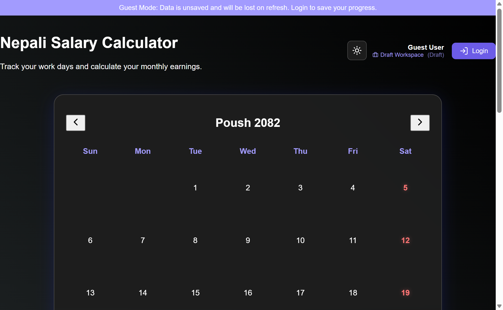
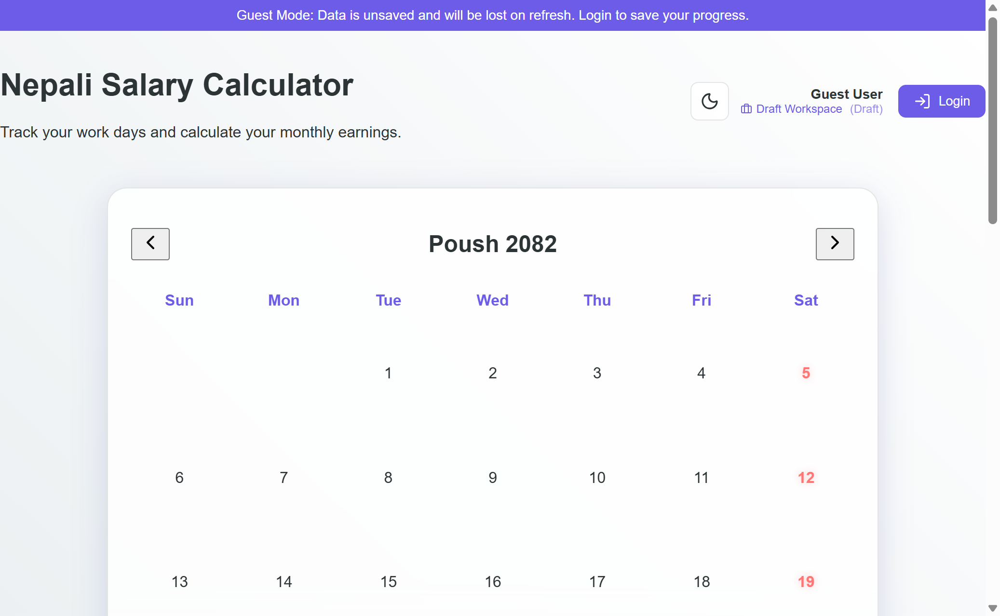

<div align="center">

# 🇳🇵 Nepali Salary Calculator
### *The premium workspace for the Nepali workforce.*

[](https://github.com/scuba3198/salary-calculator/actions/workflows/deploy.yml)
[](https://scuba3198.github.io/salary-calculator)
[](https://react.dev/)
[](https://vite.dev/)
[](https://supabase.com/)

<br />



<br />

**[Experience the App Live](https://scuba3198.github.io/salary-calculator)**

---

<p align="left">
Modern, fast, and feature-rich. The <b>Nepali Salary Calculator</b> is designed to solve the complexity of tracking workdays across multiple organizations using the native <b>Bikram Sambat (B.S.)</b> calendar. Whether you're a freelancer, a full-time employee, or managing a team, this tool provides real-time financial clarity.
</p>

</div>

---

## 💎 Visual Showcase

| Light Mode Interface | Dark Mode Interface |
| :---: | :---: |
|  |  |

---

## ✨ Premium Features

### 🛡️ Smart Guest Protocol
> **No account? No problem.**
*   **Instant Access**: Use the full suite of tools immediately via "Transient Guest Mode".
*   **Persistent Drafts**: Your settings and dates are safely stored in your browser while you test.
*   **Merge Catalyst**: When you're ready to create an account, one click merges all your local guest data into the cloud. **Zero data loss.**

### 🏢 Elite Workspace Management
*   **Unlimited Organizations**: Manage concurrent jobs or clients in separate silos.
*   **Granular Economics**: Fine-tune hourly rates (Rs), daily hours, and TDS (%) per workspace.
*   **Switching Engine**: A lightning-fast interface to jump between organizations.

### 🇳🇵 Native Calendar Precision
*   **Pure Nepali Experience**: Fully integrated B.S. calendar system.
*   **Holiday & Weekend Intel**: Automatic visual cues for non-working days.
*   **Intuitive Marking**: A "tap-to-log" system that makes tracking feel like a breeze.

### 📊 Financial Command Center
*   **Live Gross/Net Logic**: Real-time salary projection as you toggle dates.
*   **TDS Automation**: Accurate tax deductions calculated instantly based on individual workspace laws.
*   **Historical Accuracy**: View and verify stats for any month or year.

---

## 🛠️ The Technology Core

The application is built on a "Lean-Core" architecture, ensuring maximum performance without bloated dependencies.

| Technology | Purpose |
| :--- | :--- |
| **React 19** | Modern UI primitives and state synchronization. |
| **Vite 7** | Next-generation build tool for instant HMR. |
| **Supabase** | Hybrid PostgreSQL & Real-time Auth backbone. |
| **Vanilla CSS** | Pure, hand-optimized styles for a "Glassmorphism" look. |
| **JS-B.S.** | High-precision Nepali date conversion logic. |

---

## 🚀 Speed Start

### 1. Zero-Config Install
```bash
git clone https://github.com/scuba3198/salary-calculator.git
cd salary-calculator
npm install
```

### 2. Pulse Check (Local Dev)
```bash
npm run dev
```

### 3. Production Hardening
```bash
npm run build
npm run preview
```

---

## 📜 Repository Health

- `npm run lint`: Maintain industrial-standard code quality.
- `deploy.yml`: Automated CI/CD pipeline targeting GitHub Pages.

---

<div align="center">
  <sub>Built with ❤️ by <a href="https://github.com/scuba3198">Mumukshu D.C</a></sub>
  <br />
  <sub>&copy; 2026 Salary Calculator. All rights reserved.</sub>
</div>
