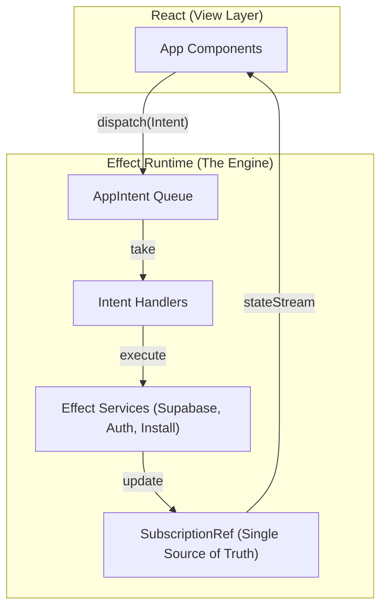

<div align="center">

# 🇳🇵 Nepali Salary Calculator
### *The premium workspace for the Nepali workforce.*

[](https://github.com/scuba3198/salary-calculator/actions/workflows/deploy.yml)
[](https://scuba3198.github.io/salary-calculator)
[](https://react.dev/)
[](https://www.typescriptlang.org/)
[](https://vite.dev/)
[](https://supabase.com/)

<br />


<br />

**[Experience the App Live](https://scuba3198.github.io/salary-calculator)**

---

<p align="left">
Modern, fast, and feature-rich. The **Nepali Salary Calculator** is a premium workspace designed to solve the complexity of tracking workdays across multiple organizations using the native **Bikram Sambat (B.S.)** calendar.

The application is powered by a **Pure Effect-TS Architecture**, where React serves strictly as a logic-less view layer ("Dumb Terminal") while Effect manages the entire application lifecycle, state transitions, and concurrency.

</div>

---

## 🏗️ Architectural Blueprint

The system follows a strict **Reactive Loop** where all side effects are managed by the Effect Runtime.


```mermaid
graph TD
    subgraph "React (View Layer)"
        UI["App Components"]
    end

    subgraph "Effect Runtime (The Engine)"
        Queue["AppIntent Queue"]
        Handlers["Intent Handlers"]
        Services["Effect Services (Supabase, Auth, Install)"]
        State["SubscriptionRef (Single Source of Truth)"]
    end

    UI -- "dispatch(Intent)" --> Queue
    Queue -- "take" --> Handlers
    Handlers -- "execute" --> Services
    Services -- "update" --> State
    State -- "stateStream" --> UI
```

---

## 💎 Visual Showcase

| Light Mode Interface | Dark Mode Interface |
| :---: | :---: |
|  |  |

---

## ✨ Premium Features

### 🛡️ Smart Guest Protocol
> **No account? No problem.**
*   **Instant Access**: Use the full suite of tools immediately via "Transient Guest Mode".
*   **Effect Persistence**: Your settings and dates are safely synced to `localStorage` via an Effect stream.
*   **Merge Catalyst**: When you're ready to create an account, existing guest data is automatically migrated. **Zero data loss.**

### 🏢 Elite Workspace Management
*   **Unlimited Organizations**: Manage concurrent jobs or clients in separate silos.
*   **Race-Condition Free**: Switching workspaces interrupts previous sync fibers, ensuring zero state pollution.
*   **Granular Economics**: Fine-tune hourly rates (Rs), daily hours, and TDS (%) per workspace.

### 🇳🇵 Native Calendar Precision
*   **Pure Nepali Experience**: Fully integrated Bikram Sambat system.
*   **Holiday & Weekend Intel**: Automatic visual cues for non-working days.
*   **Intuitive Marking**: A "tap-to-log" system that makes tracking feel like a breeze.

### 📊 Financial Command Center
*   **Live Gross/Net Logic**: Real-time salary projection as you toggle dates.
*   **Purity First**: All calculations are pure, synchronous functions, ensuring deterministic results across any platform.

---

## 🛠️ The Technology Core

| Technology | Purpose |
| :--- | :--- |
| **Effect-TS** | The "Operating System" — state, concurrency, and logic. |
| **React 19** | The "Dumb Screen" — rendering UI via `useSyncExternalStore`. |
| **TypeScript** | Strict, industrial-grade type safety with `@tsconfig/strictest`. |
| **Supabase** | Backend infrastructure (PostgreSQL & Real-time Auth). |
| **Vanilla CSS** | Pure, hand-optimized styles for a "Glassmorphism" look. |
| **PWA** | Offline-first functionality with specialized stress-tested resilience. |

---

## 🧪 Testing Architecture

We employ an **Ironclad Purity Protocol** to guarantee 100% reliability:

- **Logic Audit**: Automated `grep` scans ensure **zero forbidden patterns** (`async/await`, `try/catch`, `let`, `for`) exist in the production logic.
- **PWA Stress Testing**: Cross-browser **Playwright** suite that simulates extreme hardware/network conditions (Lie-Fi, storage wipe, rapid orientation change).
- **Unit Math**: **Vitest** verified calculations for Nepali tax laws and hours.
- **Continuous Integration**: Sequential fail-fast pipeline executing Typecheck → Lint → Unit → Build → E2E Stress.

---

## 🚀 speed Start

### 1. Zero-Config Install
```bash
git clone https://github.com/scuba3198/salary-calculator.git
cd salary-calculator
npm install
```

### 2. Local Development
```bash
npm run dev
```

### 3. Verification Suite
```bash
# Run full stability check
npm run check && npm run typecheck && npm run test
```

---

## 📜 Repository Health

- `npm run lint`: Maintain industrial-standard code quality via Biome.
- `ci.yml`: Automated verification pipeline.
- `deploy.yml`: Automated CD pipeline for GitHub Pages.

---

<div align="center">
  <sub>Built with ❤️ by <a href="https://github.com/scuba3198">Mumukshu D.C</a></sub>
  <br />
  <sub>&copy; 2026 Salary Calculator. All rights reserved.</sub>
</div>
